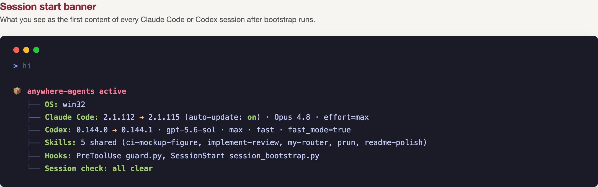
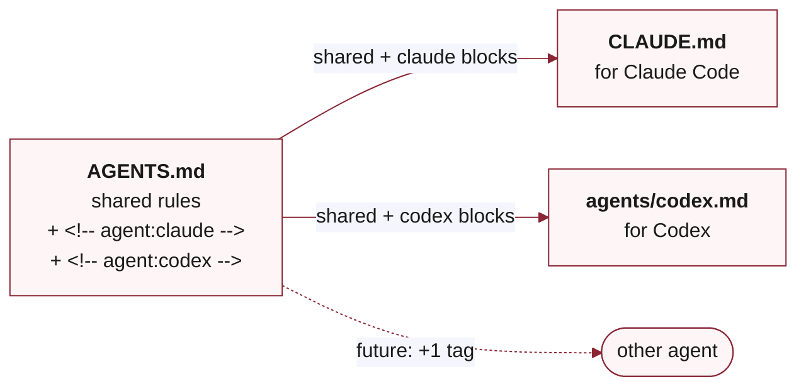

<a id="readme-top"></a>

<div align="center">

**English · [中文](README.zh-CN.md)**

# anywhere-agents

**One config for every agent — Claude Code, Codex, and whatever comes next.**

Start with effective defaults. Add **packs**, small bundles of rules, skills, or permissions, as you need them. One `AGENTS.md` drives every agent in every repo on every machine.

[](https://pypi.org/project/anywhere-agents/)
[](https://www.npmjs.com/package/anywhere-agents)
[](https://anywhere-agents.readthedocs.io/)
[](LICENSE)
[](https://github.com/yzhao062/anywhere-agents/actions/workflows/validate.yml)
[](https://github.com/yzhao062/anywhere-agents)

[Install](#install) &nbsp;•&nbsp;
[Why](#why-youd-use-this) &nbsp;•&nbsp;
[How it works](#how-it-works) &nbsp;•&nbsp;
[Pack CLI](#pack-management-cli) &nbsp;•&nbsp;
[Docs](https://anywhere-agents.readthedocs.io) &nbsp;•&nbsp;
[Fork](#fork-and-customize)

</div>


> [!NOTE]
> **Condensed from daily use.** The sanitized public release of the agent config I have run daily since early 2026 across research, paper writing, and dev work (PyOD 3, LaTeX, admin) on macOS, Windows, and Linux. Not a weekend project. Maintained by [Yue Zhao](https://yzhao062.github.io) — USC CS faculty and author of [PyOD](https://github.com/yzhao062/pyod) (9.8k★ · 38M+ downloads · ~12k citations).

## Why You'd Use This

Four problems this fixes:

**You use more than one agent.** Claude Code at work, Codex on personal projects, Cursor on the side. Without `anywhere-agents`, three configs to keep in sync. With it, one `AGENTS.md` drives all three.

**You work across many repos.** Every new project repeats the same setup ritual: writing-style rules, permission policies, custom skills. Without `anywhere-agents`, you copy-paste between repos and watch them drift. With it, `bootstrap` pulls shared defaults and layers repo-local overrides on top.

**You want a review loop before you push.** `anywhere-agents` ships `/implement-review`, a skill that hands your staged diff to a second reviewer (Codex, Copilot, or whichever you configure), converges on feedback, and revises. Without it, you wire reviewer APIs per project. With it, the skill is present the first time you bootstrap.

**You want your agents to follow writing conventions automatically.** The default `agent-style` rule pack bans ~45 AI-tell words and formatting patterns; a PreToolUse guard denies any `.md` / `.tex` / `.rst` write that contains one. Without `anywhere-agents`, the banned words land in your files. With it, the guard blocks the write.

**As of v0.6.0:** Bare `anywhere-agents` is the canonical apply command — one verb that bootstraps, deploys, applies prompt-policy drift on mutable refs, and regenerates `CLAUDE.md`. Direct-URL pack fetch + auth chain + drift application all run in the same command. The [`agent-pack`](https://github.com/yzhao062/agent-pack) reference repo is the **blueprint** for any pack you want to author: your own profile, paper workflow, team conventions, custom skills. The pattern is fork-and-replace. Fork ap, replace its three packs with your content, tag a release, then point `pack add` at your fork:

```bash
anywhere-agents pack add https://github.com/yzhao062/agent-pack --ref v0.1.0
```

The auth chain handles private repos automatically: SSH agent → `gh` CLI → `GITHUB_TOKEN` → anonymous, in that order, with whatever you already have configured. `--ref` is optional (defaults to `main`); pin a tag for production.

## How It Works

A **pack** is a small bundle (a rule set, a skill, or a permission policy) that the composer deploys to wherever it needs to land: `AGENTS.md`, `.claude/skills/`, `.claude/commands/`, `~/.claude/hooks/`, or `~/.claude/settings.json`.

`bootstrap` installs shipped defaults (`agent-style`, `aa-core-skills`) and assembles project-active selections from `rule_packs:` in `agent-config.yaml`, `rule_packs:` in `agent-config.local.yaml`, and the `AGENT_CONFIG_PACKS` env var as a transient name list. Each entry is either a registered name (resolved against `bootstrap/packs.yaml`) or a direct-URL form with a `source: {url, ref}` field. v0.5.0's 4-method auth chain fetches both public and private repos with whatever Git authentication you already have configured.

As of v0.6.0, the bundled-default policy table is `agent-style` (passive) → `auto` (silent refresh + stderr summary) and `aa-core-skills` (active) → `prompt` (apply-by-default + stderr summary). Third-party packs default to `prompt`. Bare `anywhere-agents` applies prompt-policy drift on mutable refs inline; the run prints one stderr summary line per affected pack (`applied 1 update for <pack> @ <ref>: <old> -> <new>`). Per-run skip is available via `ANYWHERE_AGENTS_UPDATE=skip` (v0.5.0 contract) or the `--no-apply-drift` CLI flag (the flag wins when both are set). Durable fail-closed: pin `update_policy: locked` in `agent-config.yaml`. The `anywhere-agents pack add | remove | list` CLI writes a user-level manifest at `$XDG_CONFIG_HOME/anywhere-agents/config.yaml`. As of v0.5.2, `pack add` is one-shot: it writes the entry, runs the composer, and deploys in a single command.

`anywhere-agents` is the sync step. Re-run it on any machine or repo, and the same command reproduces the shipped defaults plus the project-level selections, applies any drift, and refreshes generated files.

## What This Looks Like

### Every Session Opens with a Status Banner



Current and latest versions of Claude Code and Codex (arrows appear only when they differ); auto-update state; active skills (local + shared); hooks (`guard.py` PreToolUse, `session_bootstrap.py` SessionStart); any drift flagged by the session check. If anything needs attention, the last line names it with a concrete action (for example, `⚠ actions/checkout@v4 in .github/workflows/validate.yml:17 — bump to v5`).

### What Appears in Your Repo After Bootstrap

```text
your-project/
├── AGENTS.md              # shared rules synced from upstream
├── AGENTS.local.md        # your per-project overrides (optional)
├── CLAUDE.md              # generated from AGENTS.md for Claude Code
├── agents/codex.md        # generated from AGENTS.md for Codex
├── agent-config.yaml      # (optional) per-project pack selections
├── .claude/
│   ├── commands/          # slash-command pointers for shipped skills
│   └── settings.json      # your project keys merged with shared
├── .agent-config/         # upstream cache (gitignored)
└── skills/                # (optional) repo-local skill overrides
```

Bootstrap also drops `guard.py` and `session_bootstrap.py` into `~/.claude/hooks/` and merges shared keys into `~/.claude/settings.json`. Everything above comes from one `bootstrap` run; re-running it keeps these files in sync with upstream.

### One `AGENTS.md`, Rules for Every Agent

Shared rules plus agent-specific blocks in one file; the generator emits one file per agent.



Add a new agent tomorrow and only the tag name changes. `scripts/generate_agent_configs.py` runs every bootstrap; the shared content stays in lock-step across agents because it lives in one source file.

### Writing That Does Not Read Like an AI

Default AI output leans on a small set of filler words and em-dash rhythm. The `agent-style` rule pack is a ban list plus formatting rules; the PreToolUse guard enforces the ban at write-time on `.md` / `.tex` / `.rst` / `.txt` files.

<table>
<tr>
<th align="left">Without <code>anywhere-agents</code></th>
<th align="left">With <code>anywhere-agents</code></th>
</tr>
<tr>
<td valign="top">

> We <mark>delve</mark> into a <mark>pivotal realm</mark> — a <mark>multifaceted endeavor</mark> that <mark>underscores</mark> a <mark>paramount facet</mark> of outlier detection, <mark>paving the way</mark> for <mark>groundbreaking</mark> advances that will <mark>reimagine</mark> the <mark>trailblazing</mark> work of our predecessors.

<em>32 words. Twelve banned-word or close-variant hits. Em-dash as casual punctuation. Every clause adds filler.</em>

</td>
<td valign="top">

> We examine outlier detection along three dimensions: coverage, interpretability, and scale. Each matters; none alone is sufficient. Prior work has addressed one or two in isolation; this work integrates all three.

<em>31 words. Zero banned words. Semicolons and colons instead of em-dashes. One idea per sentence.</em>

</td>
</tr>
</table>

The guard denies the `Write` / `Edit` tool call outright when the outgoing content contains a banned word. The agent sees the deny message with the hit list and revises before any file changes.

### `git push` Is Never a Silent Action

```text
[guard.py] ⛔ STOP! HAMMER TIME!

  command:   git push --force origin main
  category:  destructive push

This is destructive. Are you sure? (y/N)
```

The guard covers `git push`, `git commit`, `git merge`, `git rebase`, `git reset --hard`, `gh pr merge`, `gh pr create`, and related destructive commands. Read-only operations (`status`, `diff`, `log`) pass silently, so the common workflow stays fast.

## Install

> [!TIP]
> The simplest install is to tell your AI agent: _"Install anywhere-agents in this project."_ It will pick the right command from PyPI or npm.

**Recommended:**

```bash
# One-time per machine:
pipx install anywhere-agents     # or: uv tool install anywhere-agents

# Per-project (run in any repo):
anywhere-agents                          # bootstrap shared config + hooks + settings
anywhere-agents pack add <pack-repo-url>  # add a pack (one-shot: fetch, install, deploy)
```

**Choosing an install path:**

| Path | Best for |
|------|----------|
| `pipx install anywhere-agents` | **Daily use, full CLI** (bootstrap + pack mgmt) |
| `pipx run anywhere-agents` | One-shot zero-install bootstrap (e.g. CI, trying it out) |
| `npx anywhere-agents` | One-shot zero-install bootstrap, Node-native |
| `npm install -g anywhere-agents` | Persistent bootstrap, Node-first machines |
| Raw `curl` / `Invoke-WebRequest` | No package manager available (see collapsed block below) |

All paths run `bootstrap`. For `pack add | remove | verify | list | update`, install the Python CLI via `pipx install anywhere-agents`. The npm package is bootstrap-only; if you need pack commands, install the Python CLI separately on the same machine.

**Why `pipx` and not plain `pip install`?** `anywhere-agents` is a CLI tool with its own dependencies. Plain `pip install` either lands in the active venv (per-project, not per-machine) or hits PEP 668 / `externally-managed-environment` errors on modern Ubuntu / Debian / Homebrew Python. `pipx` gives each CLI tool its own isolated venv and exposes the binary on PATH globally; it is clean to upgrade, clean to remove, and avoids dependency conflicts. It is the [PyPA-recommended approach](https://packaging.python.org/en/latest/guides/installing-stand-alone-command-line-tools/) for Python CLI applications.

### How to Update

**For Claude Code, updates are automatic.** `anywhere-agents` installs a SessionStart hook that runs bootstrap every time you open a Claude Code session, so the shared `AGENTS.md`, skills, and settings stay fresh with no typing.

**For Codex or other agents** (no SessionStart hook support today), tell the agent in your first message of a session:

> `read @AGENTS.md to run bootstrap, session checks, and task routing`

This triggers the agent to read the bootstrap block in `AGENTS.md` and execute it. Same effect as the hook, one verbal invocation per session.

**To force a refresh mid-session** (for example, when the maintainer just pushed a fix you need right now):

```bash
# macOS / Linux
bash .agent-config/bootstrap.sh

# Windows (PowerShell)
& .\.agent-config\bootstrap.ps1
```

**To pin to a specific version**, fork the repo and check out a tag in your fork, then point consumers at your fork instead of the main branch.

<details>
<summary><b>Raw Shell (No Package Manager Required)</b></summary>

macOS / Linux:

```bash
mkdir -p .agent-config
curl -sfL https://raw.githubusercontent.com/yzhao062/anywhere-agents/main/bootstrap/bootstrap.sh -o .agent-config/bootstrap.sh
bash .agent-config/bootstrap.sh
```

Windows (PowerShell):

```powershell
New-Item -ItemType Directory -Force -Path .agent-config | Out-Null
Invoke-WebRequest -UseBasicParsing -Uri https://raw.githubusercontent.com/yzhao062/anywhere-agents/main/bootstrap/bootstrap.ps1 -OutFile .agent-config/bootstrap.ps1
& .\.agent-config\bootstrap.ps1
```

</details>

Source: [PyPI](https://pypi.org/project/anywhere-agents/) · [npm](https://www.npmjs.com/package/anywhere-agents) · [bootstrap scripts](https://github.com/yzhao062/anywhere-agents/tree/main/bootstrap)

## Pack Management CLI

Install the `anywhere-agents` CLI (via `pipx install anywhere-agents`) to manage packs without editing per-project YAML.


```bash
anywhere-agents                              # canonical apply: bootstrap + deploy + drift + generator
anywhere-agents pack list
anywhere-agents pack add https://github.com/yzhao062/agent-pack --ref v0.1.0
anywhere-agents pack list --drift             # read-only audit against pack-lock.json
anywhere-agents pack remove profile
anywhere-agents uninstall --all               # clean everything from the current project
```

`pack add <url>` reads the remote `pack.yaml` and writes one user-level row per declared pack (e.g., `agent-pack` expands to `profile`, `paper-workflow`, `acad-skills`). `--ref` is optional and defaults to `main`; pin a tag for production. The CLI writes to `$XDG_CONFIG_HOME/anywhere-agents/config.yaml` (POSIX) or `%APPDATA%\anywhere-agents\config.yaml` (Windows).

### Audit Pack Deployment

`pack add` is one-shot in v0.5.2: it writes user-level config rows and runs the composer to deploy into the current project in a single command. Use `pack verify` to audit existing state without writing:

```bash
anywhere-agents pack verify              # read-only audit (user, project, lock)
```

To reconcile drift, run bare `anywhere-agents` — the canonical apply path applies prompt-policy drift on mutable refs and prints one stderr summary line per affected pack. Per-run skip: `ANYWHERE_AGENTS_UPDATE=skip` env var or `--no-apply-drift` CLI flag.

> **Legacy aliases (still supported through all v0.x).** The v0.5.x commands `anywhere-agents pack verify --fix [--yes]` and `anywhere-agents pack update [<name>]` continue to work and execute the canonical apply path; each prints a one-line stderr notice pointing at `anywhere-agents`. CI scripts that use these forms keep working without changes. Removal is allowed only at v1.0 with explicit CI-migration guidance.

**Migrating from a project that bootstrapped from `agent-config`?** Run bare `anywhere-agents` (or `bash .agent-config/bootstrap.sh` directly). The CLI auto-detects the legacy `yzhao062/agent-config` upstream from `.agent-config/upstream` or the cached `.git/config`, deletes the legacy cache, and bootstraps from anywhere-agents. The detection lives in both the Python CLI and the raw shell scripts, so any entry path triggers the migration once.

Then bring back the User Profile, paper workflow, and 3 academic skills (`bibref-filler`, `dual-pass-workflow`, `figure-prompt-builder`) that previously lived in `agent-config` by adding [`agent-pack`](https://github.com/yzhao062/agent-pack):

```bash
anywhere-agents pack add https://github.com/yzhao062/agent-pack --ref v0.1.0
```

This expands to three user-level rows (`profile`, `paper-workflow`, `acad-skills`) and deploys all three in a single command.

For projects that prefer to declare packs in `agent-config.yaml` instead of using `pack add`:

```yaml
rule_packs:
  - name: profile
    source: {url: https://github.com/yzhao062/agent-pack, ref: v0.1.0}
  - name: paper-workflow
    source: {url: https://github.com/yzhao062/agent-pack, ref: v0.1.0}
  - name: acad-skills
    source: {url: https://github.com/yzhao062/agent-pack, ref: v0.1.0}
```

Bare `anywhere-agents` applies them and prints a stderr summary line per affected pack.

For the rule-pack composition contract that backs project-level `rule_packs:`, including cache, offline behavior, and failure modes, see [`docs/rule-pack-composition.md`](docs/rule-pack-composition.md).

## What's Next

`v0.5.0` shipped direct-URL pack fetch with the 4-method auth chain (SSH agent, `gh` CLI token, `GITHUB_TOKEN`, anonymous fallback), the trust-model shift to `prompt` as default `update_policy`, and the `pack update` + `pack list --drift` CLI commands. `v0.5.2` ships end-to-end pack management: `pack add` is one-shot install (writes user-level rows, runs composer, deploys), and the AC→AA migration is automatic. `v0.6.0` collapses the day-to-day update flow into a single verb: bare `anywhere-agents` is the canonical apply path; `pack verify --fix` and `pack update` survive as compatibility aliases through all v0.x; prompt-policy drift on mutable refs applies inline by default with stderr summary lines and per-run skip via `ANYWHERE_AGENTS_UPDATE=skip` or `--no-apply-drift`. `update_policy: auto` on active entries is rejected at parse with an actionable error. Shipped-status details live in the [changelog](CHANGELOG.md).

The [`agent-pack`](https://github.com/yzhao062/agent-pack) reference repo is the canonical blueprint for any pack you author: profile, paper workflow conventions, team conventions, custom skills, anything you want to share across projects. The v2 manifest schema lives there in working form. Fork ap, replace its three packs (`profile`, `paper-workflow`, `acad-skills`) with your content, tag a release, then `anywhere-agents pack add https://github.com/<you>/<your-pack> --ref <tag>`. As of v0.5.2 this is one-shot: the CLI writes user-level config rows and runs the composer to deploy in a single command.

## Deeper Docs

Full reference lives at **[anywhere-agents.readthedocs.io](https://anywhere-agents.readthedocs.io)**:

- Per-skill deep documentation (`implement-review`, `my-router`, `ci-mockup-figure`, `readme-polish`)
- `AGENTS.md` section-by-section reference
- Customization guide (fork, override, extend)
- FAQ, troubleshooting, platform notes (Windows, macOS, Linux)

## Fork and Customize

Want to diverge — change writing defaults, add skills, swap the reviewer? Standard Git, no special tooling.

1. **Fork** `yzhao062/anywhere-agents` to your GitHub account.
2. **Edit:** `AGENTS.md`, `skills/<your-skill>/`, `skills/my-router/references/routing-table.md`.
3. **Point consumers at your fork.** Pass your upstream as the bootstrap argv on first install:

    ```bash
    # Bash (macOS / Linux / Git Bash)
    curl -sfL https://raw.githubusercontent.com/<your-user>/<your-repo>/main/bootstrap/bootstrap.sh -o .agent-config/bootstrap.sh
    bash .agent-config/bootstrap.sh <your-user>/<your-repo>
    ```

    ```powershell
    # PowerShell (Windows)
    Invoke-WebRequest -UseBasicParsing -Uri https://raw.githubusercontent.com/<your-user>/<your-repo>/main/bootstrap/bootstrap.ps1 -OutFile .agent-config/bootstrap.ps1
    & .\.agent-config\bootstrap.ps1 <your-user>/<your-repo>
    ```

    Whichever value you pass (argv or `AGENT_CONFIG_UPSTREAM` env var) is persisted to `.agent-config/upstream` on that run, so later session-hook invocations pick it up automatically; you only pass it once per consumer project. Setting the env var on a later run updates the persisted value, so the env var can both seed and change the long-term upstream.

4. **Pull upstream updates when you want them:**

    ```bash
    git remote add upstream https://github.com/yzhao062/anywhere-agents.git
    git fetch upstream
    git merge upstream/main   # resolve conflicts as usual
    ```

Git is the subscription engine. Cherry-pick what you want, skip what you do not.

<details>
<summary><b>What Is Opinionated and Why</b></summary>

| Opinion | Why |
|---------|-----|
| **Safety-first by default** | `git commit` / `push` always confirm. Destructive Git/GitHub (ask) and compound-command shapes (deny) have no bypass; writing-style and banner gates have an `AGENT_CONFIG_GATES=off` escape hatch for false positives. |
| **Dual-agent review is default** | Claude Code implements; Codex reviews. Either solo still works; the second opinion is where the value is. Includes an optional Phase 0 plan-review for complex work where the shape precedes the code. |
| **Strong writing style** | ~45 banned words (enforced by PreToolUse hook on `.md` / `.tex` / `.rst` / `.txt` writes), no em-dashes as casual punctuation, no bullet-conversion of prose, no summary sentence at the end of every paragraph. Sound like you, not a chatbot. |
| **Session checks report, not fix** | Flags outdated Actions versions, wrong Codex config, model preferences — agents never silently change anything without telling you. |

Disagree with any of this? Fork it and edit.

</details>

<details>
<summary><b>Repo Layout</b></summary>

```text
anywhere-agents/
├── AGENTS.md                      # central source: tagged rule file (curated defaults)
├── CLAUDE.md                      # generated from AGENTS.md (Claude Code)
├── agents/
│   └── codex.md                   # generated from AGENTS.md (Codex)
├── bootstrap/
│   ├── bootstrap.sh               # idempotent sync for macOS/Linux
│   ├── bootstrap.ps1              # idempotent sync for Windows
│   └── packs.yaml                 # v2 unified manifest: passive + active packs (agent-style, aa-core-skills)
├── scripts/
│   ├── guard.py                   # PreToolUse hook: 4 gate families (dest-git/gh ask; compound cd / writing-style / banner deny)
│   ├── generate_agent_configs.py  # tag-based generator (AGENTS.md -> CLAUDE.md + codex.md)
│   ├── session_bootstrap.py       # SessionStart hook: runs bootstrap automatically
│   ├── compose_packs.py           # v2 composer: bundled packs, direct URLs, drift prompt, locks, state
│   ├── compose_rule_packs.py      # legacy v0.3 rule-pack composer (kept for BC)
│   ├── packs/                     # pack modules: auth, config, source fetch, state, locks, transaction, handlers
│   ├── pre-push-smoke.sh          # pre-push real-agent smoke (validates current checkout)
│   └── remote-smoke.sh            # post-publish real-agent smoke (validates published install)
├── skills/
│   ├── ci-mockup-figure/          # HTML mockups + TikZ/skia-canvas for figures
│   ├── implement-review/          # dual-agent review loop with Phase 0 plan-review (signature skill)
│   ├── my-router/                 # context-aware skill dispatcher
│   └── readme-polish/             # audit + rewrite GitHub READMEs with modern patterns
├── packages/
│   ├── pypi/                      # anywhere-agents PyPI CLI (pipx run anywhere-agents)
│   └── npm/                       # anywhere-agents npm CLI (npx anywhere-agents)
├── .claude/
│   ├── commands/                  # pointer files so Claude Code discovers the skills
│   └── settings.json              # project-level permissions
├── user/
│   └── settings.json              # user-level permissions, PreToolUse + SessionStart hooks, CLAUDE_CODE_EFFORT_LEVEL=max
├── docs/                          # Read the Docs source + README hero assets
├── tests/                         # bootstrap / guard / generator / session-bootstrap tests (Ubuntu + Windows + macOS CI, Python 3.9-3.13)
├── .github/workflows/             # validate, real-agent-smoke, package-smoke CI
├── .githooks/
│   └── pre-push                   # opt-in pre-push smoke (enable via `git config core.hooksPath .githooks`)
├── CHANGELOG.md
├── CONTRIBUTING.md
├── RELEASING.md
├── LICENSE
├── mkdocs.yml                     # Read the Docs config
└── .readthedocs.yaml
```

</details>

<details>
<summary><b>Related Projects</b></summary>

**Same family.** `anywhere-agents` ships alongside two companion public repos:

- [`agent-style`](https://github.com/yzhao062/agent-style): the writing-rule pack composed into every consumer's `AGENTS.md` by default. 21 rules (12 classic + 9 LLM-observed) with BAD -> GOOD examples per rule.
- [`agent-pack`](https://github.com/yzhao062/agent-pack): public reference example for third-party pack authors. Declares 3 packs (passive profile, passive paper-workflow, active academic skills) in the v2 manifest format. Fork as a starting point for your own pack repo.

**Different approaches.** If you want a general-purpose multi-agent sync tool or a broader skill catalog, these take different routes:

- [iannuttall/dotagents](https://github.com/iannuttall/dotagents) — central location for hooks, commands, skills, AGENTS/CLAUDE.md files
- [microsoft/agentrc](https://github.com/microsoft/agentrc) — repo-ready-for-AI tooling
- [agentfiles on PyPI](https://pypi.org/project/agentfiles/) — CLI that syncs configurations across multiple agents

`anywhere-agents` is intentionally narrower: a published, maintained, opinionated configuration, not a tool that manages configurations. Fork it if you like the setup; use one of the tools above if you want a universal manager.

</details>

<details>
<summary><b>What This Is Not</b></summary>

- Not a general-purpose framework or plugin host. The `anywhere-agents` CLI is narrow: it bootstraps a project (zero-install via `pipx run` / `npx`) and manages user-level pack selections (`pack add | remove | list | uninstall`). Nothing more.
- Not a universal multi-agent sync tool. Claude Code + Codex is the supported set. Other agents (Cursor, Aider, Gemini CLI) may work via the `AGENTS.md` convention but are not tested here.
- Not a marketplace or registry. One curated configuration, two first-party packs (`agent-style`, `aa-core-skills`), one maintainer. Third-party packs from arbitrary GitHub URLs work via the v0.5.0 direct-URL flow.

</details>

<details>
<summary><b>Limitations and Caveats</b></summary>

- Requires `git` everywhere. Requires Python (stdlib only) for settings merge; bootstrap continues without merge if Python is unavailable.
- Guard hook deploys to `~/.claude/hooks/guard.py` and modifies `~/.claude/settings.json`. To opt out of user-level modifications, remove the user-level section from `bootstrap/bootstrap.sh` / `bootstrap/bootstrap.ps1` in your fork.
- `AGENT_CONFIG_GATES=off` in the `env` block of `~/.claude/settings.json` disables only the writing-style and banner gates. Destructive Git/GitHub and compound-command guards stay active.

</details>

<details>
<summary><b>Maintenance and Support</b></summary>

- **Maintained:** the author's daily-use workflow. Changes land when the author needs them.
- **Not maintained:** feature requests that do not match the author's work. Users should fork.
- **Best-effort:** bug reports, PRs for clear fixes, documentation improvements.

See [CONTRIBUTING.md](CONTRIBUTING.md) for how to propose changes.

</details>

## License

Apache 2.0. See [LICENSE](LICENSE).

<div align="center">

<a href="#readme-top">↑ back to top</a>

</div>
