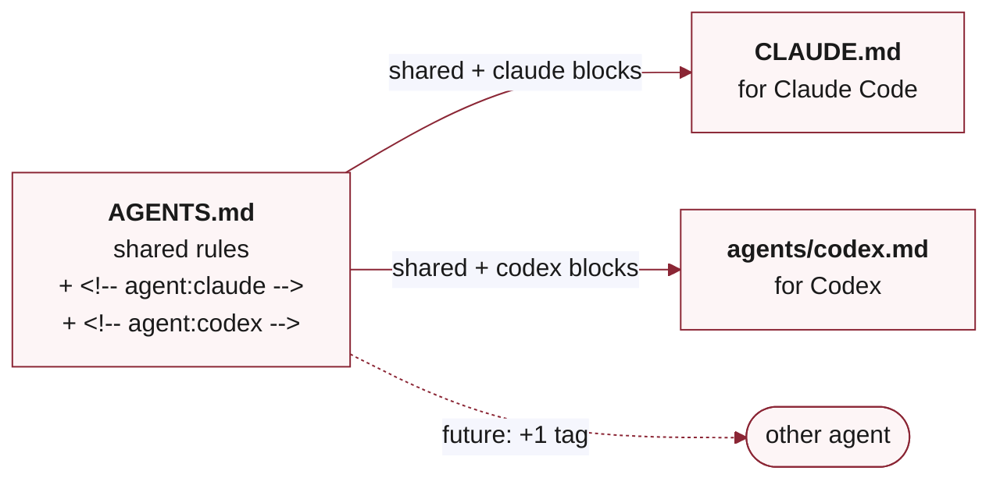

<a id="readme-top"></a>

<div align="center">

**[English](README.md) · 中文**

# anywhere-agents

**所有 agent 共用同一份配置 —— Claude Code、Codex，未来出现的任何工具也一样。**

从一套已经能用的默认配置开始，按需加上 **pack**（规则、skill 或权限的小包）。一份 `AGENTS.md`，每个 repo、每台机器、每个 agent 看到的是同一份规则。

[](https://pypi.org/project/anywhere-agents/)
[](https://www.npmjs.com/package/anywhere-agents)
[](https://anywhere-agents.readthedocs.io/)
[](LICENSE)
[](https://github.com/yzhao062/anywhere-agents/actions/workflows/validate.yml)
[](https://github.com/yzhao062/anywhere-agents)

[安装](#安装) &nbsp;·&nbsp;
[为什么](#为什么用它) &nbsp;·&nbsp;
[工作原理](#工作原理) &nbsp;·&nbsp;
[Pack CLI](#pack-管理-cli) &nbsp;·&nbsp;
[文档](https://anywhere-agents.readthedocs.io) &nbsp;·&nbsp;
[Fork](#fork-与定制)

</div>


> [!NOTE]
> **从每天用的东西浓缩出来的。** 这是我从 2026 年初起每天在用的 agent 配置的公开脱敏版 —— 场景覆盖科研、论文、写代码（PyOD 3、LaTeX、各种杂事），macOS / Windows / Linux 都有。不是周末写来玩的。维护者 [Yue Zhao](https://yzhao062.github.io)，USC 计算机系教员，[PyOD](https://github.com/yzhao062/pyod) 作者（9.8k★ · 38M+ 下载 · ~12k 学术引用）。

## 为什么用它

几个一直存在、但单独看都不值得专门修、合起来却挺耗人的问题：

**你不只用一个 agent。** 工作里 Claude Code，业余项目 Codex，偶尔 Cursor 做点别的事。没有 `anywhere-agents`，三份配置各自飘；有了它，一份 `AGENTS.md` 管三个。

**你在好几个 repo 之间跳。** 每开一个新项目都得重复同一套仪式：写作规则、权限策略、自定义 skill。手动复制粘贴以后看着它们一点一点走样，累积起来很烦人。`bootstrap` 把共享默认拉下来，再在上面叠你这个项目自己的改动。

**你想在 push 之前先有人看一眼。** `anywhere-agents` 自带 `/implement-review` 这个 skill：把 staged diff 递给第二个 reviewer（Codex / Copilot / 你配的任何一个），收反馈、改、再来一轮，直到没意见。不用它的话，你每个项目单独接 reviewer API；用了，第一次 bootstrap 就有了。

**你想 agent 写东西自动不带 AI 味儿。** 默认的 `agent-style` rule pack 禁了 ~45 个典型 AI-tell 词和格式（em-dash 当随手用、散文被切成 bullet 之类），再加一个 PreToolUse `guard`，任何 `.md` / `.tex` / `.rst` 的 tool 调用只要 outgoing 里撞上这些词，`guard` 直接 deny。没它，那些词就进你文件了；有它，写入在落盘前就被拦下来。

**v0.5.0 已经发了：** Direct-URL pack fetch + auth chain + drift prompt 都已经发布。[`agent-pack`](https://github.com/yzhao062/agent-pack) 这个参考 repo 是任何 pack 的**蓝本**：你自己的 profile、paper workflow、团队约定、自定义 skill，全都按这个形状来。模式就是 fork-and-replace。fork ap，把它的三个 pack 换成你自己的内容，打 tag 发布，然后让 `pack add` 指向你 fork 的版本：

```bash
anywhere-agents pack add https://github.com/yzhao062/agent-pack --ref v0.1.0
```

私有 repo 自动走 auth chain：SSH agent → `gh` CLI → `GITHUB_TOKEN` → 匿名，按这个顺序，用你已经配好的那一套就够。`--ref` 可选，省略时默认 `main`；生产环境 pin tag。

## 工作原理

一个 **pack** 就是一个小包：一组规则、一个 skill、或者一份权限策略。`composer` 把它送到该到的位置 —— `AGENTS.md`、`.claude/skills/`、`.claude/commands/`、`~/.claude/hooks/`、或 `~/.claude/settings.json`。

`bootstrap` 装自带的默认 pack（`agent-style` 和 `aa-core-skills`），并从这些来源组装项目级 selection：`agent-config.yaml` 里的 `rule_packs:`、`agent-config.local.yaml` 里的 `rule_packs:`，加 `AGENT_CONFIG_PACKS` 环境变量作为临时列表。每个 entry 要么是已注册的 pack 名（在 `bootstrap/packs.yaml` 里查），要么是 direct-URL 形式带 `source: {url, ref}` 字段。v0.5.0 的 4-method auth chain 用你已经配好的标准 Git 认证拉公开和私有 repo。

`update_policy` 默认是 `prompt`：每次 bootstrap 把上游 drift 列出来，你说装才装。`update_policy: locked` 是给那种永远不能自动刷新的内容做的 per-pack 退出。`anywhere-agents pack add | remove | list` CLI 写一份用户级 manifest 到 `$XDG_CONFIG_HOME/anywhere-agents/config.yaml`。从 v0.5.2 起，`pack add` 是一步到位：写行 + 跑 composer + 部署，全在一个命令里。

`bootstrap` 就是同步那一步。换一台机器或 repo 再跑一遍，结果一致：自带默认 + 你声明的项目级 selection。

## 长什么样

### 每次 session 启动都有一条状态横幅


Claude Code 和 Codex 的当前版本 + 最新版本（只在不一致时才画箭头）、auto-update 状态、已装 skill（local + shared）、hook（`guard.py` PreToolUse、`session_bootstrap.py` SessionStart）、以及 session 启动检查发现的 drift。哪里该动，最后一行给出具体动作（比如 `⚠ actions/checkout@v4 in .github/workflows/validate.yml:17 — bump to v5`）。

### bootstrap 之后你的 repo 长这样

```text
your-project/
├── AGENTS.md              # shared rules synced from upstream
├── AGENTS.local.md        # your per-project overrides (optional)
├── CLAUDE.md              # generated from AGENTS.md for Claude Code
├── agents/codex.md        # generated from AGENTS.md for Codex
├── agent-config.yaml      # (optional) per-project pack selections
├── .claude/
│   ├── commands/          # slash-command pointers for shipped skills
│   └── settings.json      # your project keys merged with shared
├── .agent-config/         # upstream cache (gitignored)
└── skills/                # (optional) repo-local skill overrides
```

`bootstrap` 还会把 `guard.py` 和 `session_bootstrap.py` 放到 `~/.claude/hooks/`，以及把共享 key 合并到 `~/.claude/settings.json`。以上都是一次 `bootstrap` 的结果；再跑一遍，这些文件都跟上游同步。

### 一份 AGENTS.md，每个 agent 一个生成文件

`AGENTS.md` 里是共享规则 + 用注释包起来的 agent-specific 块。每次 `bootstrap` 都会跑 `scripts/generate_agent_configs.py`，从同一个源文件生成每个 agent 自己看的文件：



明天加一个新 agent，只要给它一个 tag 名字。共享那部分留在同一个源文件里，跨 agent 自动保持一致。

### 写出来不像 AI 的文字

默认 AI 一开口就是一小撮固定词 + em-dash 节奏。`agent-style` rule pack 是一份词表 + 一套格式规则；PreToolUse `guard` 在 `.md` / `.tex` / `.rst` / `.txt` 写入时挡下来：

<table>
<tr>
<th align="left">没有 <code>anywhere-agents</code></th>
<th align="left">有 <code>anywhere-agents</code></th>
</tr>
<tr>
<td valign="top">

> We <mark>delve</mark> into a <mark>pivotal realm</mark> — a <mark>multifaceted endeavor</mark> that <mark>underscores</mark> a <mark>paramount facet</mark> of outlier detection, <mark>paving the way</mark> for <mark>groundbreaking</mark> advances that will <mark>reimagine</mark> the <mark>trailblazing</mark> work of our predecessors.

<em>32 words。12 个被禁词或近义变体。em-dash 当随手标点。每个分句都在凑字数。</em>

</td>
<td valign="top">

> We examine outlier detection along three dimensions: coverage, interpretability, and scale. Each matters; none alone is sufficient. Prior work has addressed one or two in isolation; this work integrates all three.

<em>31 words。零被禁词。分号、冒号代替 em-dash。一句一个想法。</em>

</td>
</tr>
</table>

outgoing 一旦撞上禁词，`guard` 直接 deny 这次 `Write` / `Edit` tool 调用，并把命中列表返回给 agent。agent 看到 deny 消息后重写，文件不会被改。

（注：当前 `agent-style` 是英文写作规则。如果你主要用中文写作，现在拦的只是英文部分；中文 AI-tell 词表是 v0.5 之后的 scope。）

### `git push` 永远不是无声操作

```text
[guard.py] ⛔ STOP! HAMMER TIME!

  command:   git push --force origin main
  category:  destructive push

This is destructive. Are you sure? (y/N)
```

`guard` 覆盖 `git push` / `git commit` / `git merge` / `git rebase` / `git reset --hard` / `gh pr merge` / `gh pr create` 这类可能有破坏性的命令。读操作（`status` / `diff` / `log`）直接通过，日常流不被打断。

## 安装

> [!TIP]
> 最简单的装法就是跟你的 AI agent 说一句："把 anywhere-agents 装到这个项目。" 它会自己选 PyPI 还是 npm。

**推荐**：

```bash
# 一次性 per-machine：
pipx install anywhere-agents     # 或者：uv tool install anywhere-agents

# 任何项目里：
anywhere-agents                          # bootstrap：拉共享 config + hooks + settings
anywhere-agents pack add <pack-repo-url>  # 加一个 pack（一步到位：fetch、install、deploy）
```

**几种安装路径的区别**：

| 路径 | 用途 |
|------|------|
| `pipx install anywhere-agents` | **日常使用、全功能 CLI**（bootstrap + pack 管理） |
| `pipx run anywhere-agents` | 一次性零安装跑 bootstrap（CI、试一下） |
| `npx anywhere-agents` | 一次性零安装跑 bootstrap，Node 原生 |
| `npm install -g anywhere-agents` | 全局装 bootstrap，Node-first 的机器 |
| Raw `curl` / `Invoke-WebRequest` | 没装包管理器（见下方折叠块） |

所有路径都能跑 `bootstrap`。要用 `pack add | remove | verify | list | update`，装 Python CLI：`pipx install anywhere-agents`。npm 包只覆盖 `bootstrap`；要用 pack 命令，得在同一台机器上另外装 Python CLI。

**为什么是 `pipx` 而不是 `pip install`？** `anywhere-agents` 是个 CLI 工具，自己有依赖（PyYAML 等）。直接 `pip install` 要么落进当前 venv（per-project，不是 per-machine），要么在新一点的 Ubuntu / Debian / Homebrew Python 上撞 PEP 668 / `externally-managed-environment` 报错。`pipx` 给每个 CLI 工具单独建隔离 venv 并把 binary symlink 到 PATH 上；升级、卸载都干净，依赖不会和别的工具打架。这是 [PyPA 官方推荐](https://packaging.python.org/en/latest/guides/installing-stand-alone-command-line-tools/) 的 Python CLI 安装方式。

### 怎么更新

**Claude Code 自动更新。** `anywhere-agents` 装了一个 SessionStart hook，每次你打开 Claude Code 都会跑 bootstrap，共享 `AGENTS.md`、skills、settings 都保持最新，你什么都不用输。

**Codex 或别的 agent**（目前不支持 SessionStart hook），在一次 session 的第一条消息里跟 agent 说：

> `read @AGENTS.md to run bootstrap, session checks, and task routing`

这会触发 agent 读 `AGENTS.md` 里的 bootstrap 块并执行。一次 session 一次口头命令，效果等同于 hook。

**中途强制刷新**（比如维护者刚推了一个修复，你立刻想用上）：

```bash
# macOS / Linux
bash .agent-config/bootstrap.sh

# Windows（PowerShell）
& .\.agent-config\bootstrap.ps1
```

**想锁在一个特定版本**：fork 仓库、在你的 fork 里 checkout 一个 tag，让 consumer 指向你的 fork 而不是 main。

<details>
<summary><b>Raw Shell（不走包管理器）</b></summary>

macOS / Linux：

```bash
mkdir -p .agent-config
curl -sfL https://raw.githubusercontent.com/yzhao062/anywhere-agents/main/bootstrap/bootstrap.sh -o .agent-config/bootstrap.sh
bash .agent-config/bootstrap.sh
```

Windows（PowerShell）：

```powershell
New-Item -ItemType Directory -Force -Path .agent-config | Out-Null
Invoke-WebRequest -UseBasicParsing -Uri https://raw.githubusercontent.com/yzhao062/anywhere-agents/main/bootstrap/bootstrap.ps1 -OutFile .agent-config/bootstrap.ps1
& .\.agent-config\bootstrap.ps1
```

</details>

来源：[PyPI](https://pypi.org/project/anywhere-agents/) · [npm](https://www.npmjs.com/package/anywhere-agents) · [bootstrap scripts](https://github.com/yzhao062/anywhere-agents/tree/main/bootstrap)

## Pack 管理 CLI

装一个 `anywhere-agents` CLI（`pipx install anywhere-agents`），就能不改每个项目的 YAML 来管 pack。


```bash
anywhere-agents pack list
anywhere-agents pack add https://github.com/yzhao062/agent-pack --ref v0.1.0
anywhere-agents pack update profile         # 更新 ap 装出来的其中一行
anywhere-agents pack list --drift           # 只读 audit，对比 pack-lock.json
anywhere-agents pack remove profile
anywhere-agents uninstall --all             # 把当前项目里的所有东西清掉
```

`pack add <url>` 读远端 `pack.yaml`，按 manifest 里声明的每个 pack 写一行用户级配置（比如 `agent-pack` 展开成 `profile`、`paper-workflow`、`acad-skills` 三行）。`--ref` 可选，省略时默认 `main`；生产环境 pin tag。CLI 写到 `$XDG_CONFIG_HOME/anywhere-agents/config.yaml`（POSIX）或 `%APPDATA%\anywhere-agents\config.yaml`（Windows）。

### 验证 pack 部署状态

`pack add` 在 v0.5.2 是一步到位：写用户级 config 行 + 跑 composer 把 pack 部署到当前项目，全在一个命令里。`pack verify` 用来审计现状或在多台机器之间对齐 drift：

```bash
anywhere-agents pack verify              # 只读审计（user / project / lock 三层）
anywhere-agents pack verify --fix --yes  # 写入缺失的 project rows + 跑 composer 部署
```

`verify --fix` 在 v0.5.2 把以前"先写 rows、再 re-run bootstrap"的两步合成一个命令。

**项目原本是从 `agent-config` bootstrap 的，怎么过渡？** 从 v0.5.2 起，直接跑 `anywhere-agents`（或者 `bash .agent-config/bootstrap.sh` 都行）。CLI 会自动从 `.agent-config/upstream` 或缓存的 `.git/config` 里识别遗留的 `yzhao062/agent-config` upstream，把旧 cache 删掉，再从 anywhere-agents bootstrap。检测逻辑同时存在于 Python CLI 和 raw shell 脚本里，任何入口都会触发一次性迁移。

之后用 [`agent-pack`](https://github.com/yzhao062/agent-pack) 把原本 `agent-config` 自带的 User Profile、paper workflow、3 个学术 skill（`bibref-filler`、`dual-pass-workflow`、`figure-prompt-builder`）补回来：

```bash
anywhere-agents pack add https://github.com/yzhao062/agent-pack --ref v0.1.0
```

这一条命令展开成三行用户级配置（`profile`、`paper-workflow`、`acad-skills`），三个 pack 一起部署。

如果你倾向直接在 `agent-config.yaml` 里声明 pack 而不是用 `pack add`：

```yaml
rule_packs:
  - name: profile
    source: {url: https://github.com/yzhao062/agent-pack, ref: v0.1.0}
  - name: paper-workflow
    source: {url: https://github.com/yzhao062/agent-pack, ref: v0.1.0}
  - name: acad-skills
    source: {url: https://github.com/yzhao062/agent-pack, ref: v0.1.0}
```

下一次 `bootstrap` 会把这些 pack 应用上，或者跑 `anywhere-agents pack verify --fix` 立即部署。

项目级 `rule_packs:` 的那套 composition 契约（manifest、cache、离线行为、失败模式）见 [`docs/rule-pack-composition.md`](docs/rule-pack-composition.md)。

## 下一步

`v0.5.0` 发的是 direct-URL pack fetch、4-method auth chain（SSH agent、`gh` CLI token、`GITHUB_TOKEN`、匿名 fallback）、信任模型转向（`update_policy` 默认从 `locked` 改成 `prompt`），加上 `pack update` + `pack list --drift` 这两个 CLI 命令。`v0.5.2` 发的是端到端 pack 管理：`pack add` 一步到位（写用户级行、跑 composer、部署）、`pack verify --fix` 一个命令对齐 drift、AC→AA 迁移自动检测。`v0.6.0` 把 end-to-end command-log harness 接上来收紧 CI token-leak 覆盖；v0.5.0 自带的 redaction primitives 和 unit assertions 已经覆盖 auth-chain primitive。发布状态详情在 [changelog](CHANGELOG.md)。

[`agent-pack`](https://github.com/yzhao062/agent-pack) 这个参考 repo 是任何 pack 作者的**蓝本**：profile、paper workflow 约定、团队约定、自定义 skill，所有你想跨项目复用的 personalization 都按这个形状来。v2 manifest schema 在那里以可工作的形态摆着。fork ap，把它的三个 pack（`profile`、`paper-workflow`、`acad-skills`）换成你自己的内容，打 tag 发布，然后用 `anywhere-agents pack add https://github.com/<your-user>/<your-repo> --ref <tag>`。从 v0.5.2 起这是一步到位：CLI 写用户级配置行 + 跑 composer 在一个命令里完成部署。

## 更深的文档

完整参考在 **[anywhere-agents.readthedocs.io](https://anywhere-agents.readthedocs.io)**：

- 每个 skill 的深度文档（`implement-review`、`my-router`、`ci-mockup-figure`、`readme-polish`）
- `AGENTS.md` 一节一节的说明
- 定制指南（fork、override、扩展）
- FAQ、troubleshooting、各平台注意事项（Windows、macOS、Linux）

## Fork 与定制

想走自己的分支，改写作默认、加 skill、换 reviewer？就是标准 Git，没特殊工具。

1. **Fork** `yzhao062/anywhere-agents` 到你的 GitHub 账户。
2. **编辑：** `AGENTS.md`、`skills/<your-skill>/`、`skills/my-router/references/routing-table.md`。
3. **让 consumer 指向你的 fork。** 第一次装时把你的 upstream 作为 bootstrap argv 传进去：

    ```bash
    # Bash（macOS / Linux / Git Bash）
    curl -sfL https://raw.githubusercontent.com/<your-user>/<your-repo>/main/bootstrap/bootstrap.sh -o .agent-config/bootstrap.sh
    bash .agent-config/bootstrap.sh <your-user>/<your-repo>
    ```

    ```powershell
    # PowerShell（Windows）
    Invoke-WebRequest -UseBasicParsing -Uri https://raw.githubusercontent.com/<your-user>/<your-repo>/main/bootstrap/bootstrap.ps1 -OutFile .agent-config/bootstrap.ps1
    & .\.agent-config\bootstrap.ps1 <your-user>/<your-repo>
    ```

    argv 或 `AGENT_CONFIG_UPSTREAM` 环境变量里传进去的值会被存到 `.agent-config/upstream`，之后 session hook 自动读它 —— 每个 consumer 项目传一次就够。后来再设环境变量会覆盖持久化的值，所以环境变量既能第一次设置、也能改长期 upstream。

4. **想拉上游更新时：**

    ```bash
    git remote add upstream https://github.com/yzhao062/anywhere-agents.git
    git fetch upstream
    git merge upstream/main   # 像平时一样解冲突
    ```

Git 就是订阅机制。想要的 cherry-pick，不想要的跳过。

<details>
<summary><b>What Is Opinionated and Why（几条原则和理由）</b></summary>

| 原则 | 理由 |
|---|---|
| **安全优先作为默认** | `git commit` / `push` 永远确认。破坏性 Git / GitHub 操作（ask）和 compound-command 形式（deny）没有绕过入口；写作规则和 banner gate 保留 `AGENT_CONFIG_GATES=off`，专门处理误判。 |
| **双 agent review 作为默认** | Claude Code 写，Codex 审。单独用任何一个都行，价值在第二双眼睛。复杂工作支持 Phase 0 plan-review（结构先于代码）。 |
| **强写作规范** | ~45 个被禁词（PreToolUse hook 在 `.md` / `.tex` / `.rst` / `.txt` 写入上强制生效），em-dash 不作随手标点，散文不被 bullet 化，不是每段都拖一个尾巴句。写得像你，不像聊天机器人。 |
| **Session check 只报告，不改** | 发现旧的 Actions pin、Codex config 不对、模型 / effort 低于偏好 —— agent 不会悄悄改任何东西。 |

不同意这些？Fork 改掉。

</details>

<details>
<summary><b>Repo Layout</b></summary>

```text
anywhere-agents/
├── AGENTS.md                      # central source: tagged rule file (curated defaults)
├── CLAUDE.md                      # generated from AGENTS.md (Claude Code)
├── agents/
│   └── codex.md                   # generated from AGENTS.md (Codex)
├── bootstrap/
│   ├── bootstrap.sh               # idempotent sync for macOS/Linux
│   ├── bootstrap.ps1              # idempotent sync for Windows
│   └── packs.yaml                 # v2 unified manifest: passive + active packs (agent-style, aa-core-skills)
├── scripts/
│   ├── guard.py                   # PreToolUse hook: 4 gate families (dest-git/gh ask; compound cd / writing-style / banner deny)
│   ├── generate_agent_configs.py  # tag-based generator (AGENTS.md -> CLAUDE.md + codex.md)
│   ├── session_bootstrap.py       # SessionStart hook: runs bootstrap automatically
│   ├── compose_packs.py           # v2 composer: bundled pack、direct URL、drift prompt、locks、state
│   ├── compose_rule_packs.py      # legacy v0.3 rule-pack composer (kept for BC)
│   ├── packs/                     # pack 模块: auth、config、source fetch、state、locks、transaction、handlers
│   ├── pre-push-smoke.sh          # pre-push real-agent smoke (validates current checkout)
│   └── remote-smoke.sh            # post-publish real-agent smoke (validates published install)
├── skills/
│   ├── ci-mockup-figure/          # HTML mockups + TikZ/skia-canvas for figures
│   ├── implement-review/          # dual-agent review loop with Phase 0 plan-review (signature skill)
│   ├── my-router/                 # context-aware skill dispatcher
│   └── readme-polish/             # audit + rewrite GitHub READMEs with modern patterns
├── packages/
│   ├── pypi/                      # anywhere-agents PyPI CLI (pipx run anywhere-agents)
│   └── npm/                       # anywhere-agents npm CLI (npx anywhere-agents)
├── .claude/
│   ├── commands/                  # pointer files so Claude Code discovers the skills
│   └── settings.json              # project-level permissions
├── user/
│   └── settings.json              # user-level permissions, PreToolUse + SessionStart hooks, CLAUDE_CODE_EFFORT_LEVEL=max
├── docs/                          # Read the Docs source + README hero assets
├── tests/                         # bootstrap / guard / generator / session-bootstrap tests (Ubuntu + Windows + macOS CI, Python 3.9-3.13)
├── .github/workflows/             # validate, real-agent-smoke, package-smoke CI
├── .githooks/
│   └── pre-push                   # opt-in pre-push smoke (enable via `git config core.hooksPath .githooks`)
├── CHANGELOG.md
├── CONTRIBUTING.md
├── RELEASING.md
├── LICENSE
├── mkdocs.yml                     # Read the Docs config
└── .readthedocs.yaml
```

</details>

<details>
<summary><b>Related Projects（相关项目）</b></summary>

**同一系列。** `anywhere-agents` 和两个公开 repo 一起发：

- [`agent-style`](https://github.com/yzhao062/agent-style)：写作规则 pack，每个 consumer 的 `AGENTS.md` 默认会装。21 条规则（12 经典 + 9 LLM 实测），每条带 BAD → GOOD 例子。
- [`agent-pack`](https://github.com/yzhao062/agent-pack)：第三方 pack 作者的公开参考。用 v2 manifest 声明 3 个 pack（passive profile、passive paper-workflow、active 学术 skill）。想做自己的 pack repo，fork 它当起点。

**走不同方向的工具。** 如果你要的是通用多 agent 同步工具、或者更大的 skill 目录：

- [iannuttall/dotagents](https://github.com/iannuttall/dotagents) — hook / command / skill / AGENTS-CLAUDE.md 文件的中心位置
- [microsoft/agentrc](https://github.com/microsoft/agentrc) — 把 repo 改成 AI-ready 的工具链
- [agentfiles on PyPI](https://pypi.org/project/agentfiles/) — 跨多 agent 同步配置的 CLI

`anywhere-agents` 有意更窄：一份发布维护、带明确取舍的配置，不是"帮你管配置"的工具。喜欢这套默认，就 fork；想要通用的配置管理器，上面几个可以看看。

</details>

<details>
<summary><b>What This Is Not（不是什么）</b></summary>

- 不是通用的 framework 或 plugin host。`anywhere-agents` CLI 很窄：bootstrap 一个项目（`pipx run` / `npx` 零安装），以及管用户级 pack 选项（`pack add | remove | list | uninstall`）。除此没别的。
- 不是通用的多 agent 同步工具。支持的是 Claude Code + Codex 这套。其他 agent（Cursor、Aider、Gemini CLI）可能通过 `AGENTS.md` 约定工作，但没测过。
- 不是 marketplace 或 registry。一份精选配置，两个官方 pack（`agent-style`、`aa-core-skills`），一个维护者。第三方任意 GitHub URL 来源的 pack 走 v0.5.0 的 direct-URL flow。

</details>

<details>
<summary><b>Limitations and Caveats（限制与说明）</b></summary>

- 要求系统里有 `git`。Python（只要 stdlib）用来合并 settings；没 Python，`bootstrap` 跳过 merge 继续跑。
- `guard` hook 会部署到 `~/.claude/hooks/guard.py`、改 `~/.claude/settings.json`。不想要用户级改动，在你 fork 的 `bootstrap/bootstrap.sh` / `bootstrap/bootstrap.ps1` 里删掉 user-level 段。
- `~/.claude/settings.json` 里 `env` 设 `AGENT_CONFIG_GATES=off` 只关掉写作规则和 banner 两个 gate。破坏性 Git/GitHub 和 compound-command 两个 guard 保持生效。

</details>

<details>
<summary><b>Maintenance and Support（维护和支持）</b></summary>

- **维护中：** 作者每天在用的工作流。作者自己需要的时候才更新。
- **不维护：** 和作者工作不相关的功能请求。需要就 fork。
- **尽力而为：** bug 报告、清楚的修复 PR、文档改进。

怎么提 PR 或建议见 [CONTRIBUTING.md](CONTRIBUTING.md)。

</details>

## License

Apache 2.0。详见 [LICENSE](LICENSE)。

<div align="center">

<a href="#readme-top">↑ 回到顶部</a>

</div>
