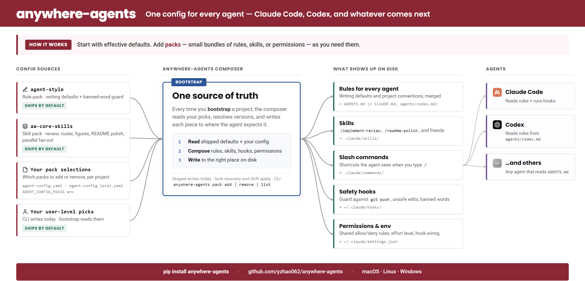

# anywhere-agents

**One config for every agent — Claude Code, Codex, and whatever comes next.**

<p align="center">
  
</p>

Start with effective defaults. Add **packs**, small bundles of rules, skills, or permissions, as you need them. One `AGENTS.md` drives every agent in every repo on every machine.

This site is the motivated-reader reference. For the scenario-first quick start, see the [README on GitHub](https://github.com/yzhao062/anywhere-agents).

## Why You'd Use This

Four problems this fixes:

- **You use more than one agent.** Claude Code at work, Codex on personal projects, Cursor on the side. One `AGENTS.md` drives all three.
- **You work across many repos.** Every new project repeats the same setup ritual. `bootstrap` pulls shared defaults and layers repo-local overrides on top.
- **You want a review loop before you push.** `/implement-review` hands your staged diff to a second reviewer, converges on feedback, and revises. Present the first time you `bootstrap`.
- **You want your agents to follow writing conventions automatically.** The default `agent-style` rule pack bans ~45 AI-tell words and formatting patterns; a PreToolUse guard denies any `.md` / `.tex` / `.rst` write that contains one.

As of v0.6.0, bare `anywhere-agents` is the canonical apply command. One verb runs bootstrap, deploys declared state, applies prompt-policy drift on mutable refs, and regenerates `CLAUDE.md` / `agents/codex.md`. Direct-URL pack fetch with the 4-method auth chain (SSH agent, `gh` CLI token, `GITHUB_TOKEN`, anonymous fallback) handles public and private repos.

## How It Works

A **pack** is a small bundle (a rule set, a skill, or a permission policy) that the composer deploys to wherever it needs to land: `AGENTS.md`, `.claude/skills/`, `.claude/commands/`, `~/.claude/hooks/`, or `~/.claude/settings.json`.

`anywhere-agents` installs the shipped defaults (`agent-style`, `aa-core-skills`) and assembles project-level selections from `rule_packs:` in `agent-config.yaml`, `rule_packs:` in `agent-config.local.yaml`, and the `AGENT_CONFIG_PACKS` env var as a transient name list. Each entry is either a registered name (resolved against `bootstrap/packs.yaml`) or a direct-URL form with a `source: {url, ref}` field.

The `anywhere-agents pack add | remove | list` CLI writes a user-level manifest to `$XDG_CONFIG_HOME/anywhere-agents/config.yaml` (POSIX) or `%APPDATA%\anywhere-agents\config.yaml` (Windows). As of v0.5.2, `pack add` is one-shot: it writes the entry, runs the composer, and deploys in a single command. Bundled-default policy (v0.6.0): `agent-style` (passive) → `auto`; `aa-core-skills` (active) → `prompt`; third-party packs default to `prompt`.

`anywhere-agents` is the sync step. Re-run it on any machine or repo, and the same command reproduces shipped defaults plus project-level selections, applies any drift, and refreshes generated files. The legacy aliases `pack verify --fix` and `pack update` continue to work through all v0.x; each prints a one-line stderr notice and dispatches to the canonical apply path.

## Quick Install

=== "PyPI"

    ```bash
    pipx run anywhere-agents
    ```

=== "npm"

    ```bash
    npx anywhere-agents
    ```

=== "Raw shell (macOS / Linux)"

    ```bash
    mkdir -p .agent-config
    curl -sfL https://raw.githubusercontent.com/yzhao062/anywhere-agents/main/bootstrap/bootstrap.sh -o .agent-config/bootstrap.sh
    bash .agent-config/bootstrap.sh
    ```

=== "Raw shell (Windows)"

    ```powershell
    New-Item -ItemType Directory -Force -Path .agent-config | Out-Null
    Invoke-WebRequest -UseBasicParsing -Uri https://raw.githubusercontent.com/yzhao062/anywhere-agents/main/bootstrap/bootstrap.ps1 -OutFile .agent-config/bootstrap.ps1
    & .\.agent-config\bootstrap.ps1
    ```

Run the command once in the project root. Next time you open Claude Code or Codex there, the agent reads `AGENTS.md` automatically and inherits every default.

For more, see [Install](install.md).

## Pack Management CLI


```bash
anywhere-agents                                                           # canonical apply: bootstrap + deploy + drift + generator
anywhere-agents pack list
anywhere-agents pack add https://github.com/yzhao062/agent-pack --ref v0.1.0
anywhere-agents pack list --drift                                         # read-only audit against pack-lock.json
anywhere-agents pack remove profile
```

**Legacy aliases.** `pack verify --fix [--yes]` and `pack update [<name>]` are full-fidelity dispatch paths into the canonical apply, retained through all v0.x. CI scripts using these forms continue to work without changes; each prints a one-line stderr notice pointing at `anywhere-agents`. Removal is allowed only at v1.0 with explicit CI-migration guidance.

**Authoring your own pack.** [`yzhao062/agent-pack`](https://github.com/yzhao062/agent-pack) is a public reference repo that declares three packs (two passive, one active) using the v2 manifest schema. Fork it as a starting point.

## What's Next

`v0.5.0` shipped direct-URL pack fetch with the 4-method auth chain, the trust-model shift to `prompt` as default `update_policy`, and the `pack update` + `pack list --drift` CLI commands. `v0.5.2` shipped end-to-end pack management: `pack add` is one-shot install (writes user-level rows, runs composer, deploys), and the AC→AA migration is automatic. `v0.6.0` collapses the day-to-day update flow into a single verb: bare `anywhere-agents` is the canonical apply path; `pack verify --fix` and `pack update` survive as compatibility aliases through all v0.x; prompt-policy drift on mutable refs applies inline by default with stderr summary lines and per-run skip via `ANYWHERE_AGENTS_UPDATE=skip` or `--no-apply-drift`. `update_policy: auto` on active entries is rejected at parse with an actionable error. Shipped-status details live in the [changelog](changelog.md).

## What This Site Covers

- **[Install](install.md)** — PyPI, npm, raw shell. Prerequisites and troubleshooting.
- **[Rule packs](rule-pack-composition.md)** — the always-on instruction layer. Covers the default `agent-style` writing pack, opt-out, pin-a-version, and how to register a new pack.
- **[Skills](skills/index.md)** — deep documentation for the four shipped skills: `implement-review`, `my-router`, `ci-mockup-figure`, `readme-polish`.
- **[AGENTS.md reference](agents-md.md)** — section-by-section tour of the shared configuration.
- **[FAQ](faq.md)** — common questions and troubleshooting.
- **[Changelog](changelog.md)** — what has shipped and when.

## Who Maintains This

Maintained by [Yue Zhao](https://yzhao062.github.io) — USC Computer Science faculty and author of [PyOD](https://github.com/yzhao062/pyod) (9.8k★, 38M+ downloads, ~12k research citations). This is the sanitized public release of the agent config used daily since early 2026 across research, paper writing, and dev work on macOS, Windows, and Linux.

## License

[Apache 2.0](https://github.com/yzhao062/anywhere-agents/blob/main/LICENSE).
