# Install

Every install path does the same thing: install `anywhere-agents` and run the bare command in the current directory. As of v0.6.0, bare `anywhere-agents` is the canonical apply command — one verb that bootstraps the project, deploys declared state, applies prompt-policy drift on mutable refs, and regenerates `CLAUDE.md` / `agents/codex.md`. The command is idempotent — safe to run every session even if `.agent-config/` already exists.

```mermaid
flowchart LR
    A[You run<br/>install command] --> B[Download<br/>bootstrap.sh / .ps1]
    B --> C[Fetch upstream<br/>AGENTS.md]
    C --> D[Sparse-clone<br/>skills/ .claude/ scripts/ user/]
    D --> E[Copy skill pointers<br/>to .claude/commands/]
    E --> F[Merge shared<br/>settings into project]
    F --> G[Install guard.py +<br/>statusline.py + agent-quota.py]
    G --> H[Merge user settings<br/>into ~/.claude/]
    H --> I[Add .agent-config/<br/>to .gitignore]
    I --> J[Done — agent<br/>reads AGENTS.md]

    classDef step fill:#fff,stroke:#8b2635,stroke-width:1.5px,color:#8b2635;
    class A,B,C,D,E,F,G,H,I,J step;
```



## PyPI

Zero-install with pipx:

```bash
pipx run anywhere-agents
```

`pipx` handles the isolated environment; re-runs always fetch the latest version. Install `pipx` itself via [pipx.pypa.io](https://pipx.pypa.io/).

Two-step alternative:

```bash
pip install anywhere-agents
anywhere-agents
```

## npm

Zero-install with npx:

```bash
npx anywhere-agents
```

Requires Node 14+.

Global install alternative:

```bash
npm install -g anywhere-agents
anywhere-agents
```

## Raw shell

No package manager required. These are the commands the PyPI and npm packages delegate to internally.

### macOS / Linux

```bash
mkdir -p .agent-config
curl -sfL https://raw.githubusercontent.com/yzhao062/anywhere-agents/main/bootstrap/bootstrap.sh -o .agent-config/bootstrap.sh
bash .agent-config/bootstrap.sh
```

### Windows (PowerShell)

```powershell
New-Item -ItemType Directory -Force -Path .agent-config | Out-Null
Invoke-WebRequest -UseBasicParsing -Uri https://raw.githubusercontent.com/yzhao062/anywhere-agents/main/bootstrap/bootstrap.ps1 -OutFile .agent-config/bootstrap.ps1
& .\.agent-config\bootstrap.ps1
```

## What the bootstrap does

1. Fetches the latest `AGENTS.md` from upstream and copies it into the project root (also `.agent-config/AGENTS.md` as the cached source).
2. Sparse-clones `skills/`, `.claude/commands/`, `.claude/settings.json`, `scripts/guard.py`, `scripts/statusline.py`, `scripts/agent-quota.py`, and `user/settings.json` into `.agent-config/repo/`.
3. Copies shared `.claude/commands/*.md` into the project's `.claude/commands/`. Non-destructive — does not delete unrelated local pointer files.
4. Merges shared `.claude/settings.json` keys into the project's copy. Project-only keys are preserved.
5. Installs `scripts/guard.py` into `~/.claude/hooks/`, installs `scripts/statusline.py` and `scripts/agent-quota.py` under `~/.claude/`, then merges `user/settings.json` into `~/.claude/settings.json`. The merge carries hook wiring, the statusLine command, `CLAUDE_CODE_EFFORT_LEVEL=xhigh`, `CLAUDE_AUTOCOMPACT_PCT_OVERRIDE=65`, `CLAUDE_CODE_SUBAGENT_MODEL=sonnet`, and user-level permissions.
6. Appends `.agent-config/` to the project's `.gitignore` if not already present.

## Pack manifest schema (v0.6.0)

Pack manifests declare passive entries (raw text injected into `AGENTS.md`) and active entries (skill files, hooks, permission rules, command pointers). v0.6.0 restores a parse-time check on the `update_policy:` field of active entries.

`update_policy:` accepts three values:

- `auto` — silent refresh on resolved-commit change. Allowed only on **passive** entries, where the wheel can pin the bundled ref and the content is plain text.
- `prompt` — apply by default with a stderr summary line on resolved-commit change. Allowed on both passive and active entries; this is the safe default for active code from third-party packs.
- `locked` — fail-closed on any drift. Allowed on both passive and active entries.

Active entries with `update_policy: auto` are rejected at parse with an error like:

```
pack 'foo': active entry at files[].to '.claude/skills/foo/' uses 'update_policy: auto'; rewrite to 'prompt' for default-apply behavior or 'locked' for fail-closed
```

The error names the offending pack, the `files[].to` path of the active entry, the policy literal, and the required rewrite. v0.5.0 silently dropped this check; v0.6.0 restores it. The trust-model rationale (silent install of arbitrary code from a mutable ref is the supply-chain risk `prompt` was designed to gate) has stood since the v0.4.0 manifest contract; see `pack-architecture.md` line 208.

## Same-ref source-path migration

Consumers pinned to `agent-style v0.3.2` whose `.agent-config/pack-lock.json` records `source_path: docs/rule-pack.md` will see the lock auto-migrate to `source_path: docs/rule-pack-compact.md` on the next bare `anywhere-agents` run. The composer detects the path mismatch against the lock for the same `requested_ref`, routes through the drift-and-migrate flow, and rewrites the deployed `AGENTS.md` body to the compact source. This honors the v0.5.7 § Compatibility commitment that consumers requiring same-ref source-path switching should stay on aa v0.5.6 until v0.6.0.

The migration prints a stderr summary line of the form:

```
migrated 1 path for agent-style @ v0.3.2: docs/rule-pack.md -> docs/rule-pack-compact.md
```

Consumers who want to keep the old full-body source must set an explicit override in `agent-config.yaml` (a `passive.files[].from: docs/rule-pack.md` block, or `update_policy: locked`); the BC-guard refinement in v0.6.0 preserves any entry with positive shape signals (`passive` / `active` keys, or `ref` / `update_policy` deviating from the bundled default).

## Prerequisites

- **`git >= 2.25`**: required for the sparse clone the bootstrap performs (`git clone --filter=blob:none --sparse`). `--sparse` is the Git 2.25 floor (2020-01-13); `--filter=blob:none` is the older partial-clone option (Git 2.19+). Bootstrap detects older git up front and exits with a platform-specific install line (macOS: `brew install git`; Debian / Ubuntu: `sudo apt update && sudo apt install -y git`; Windows: `https://git-scm.com/download/win`). Windows users: Git for Windows also provides `bash`, which both bootstrap paths benefit from. Unparseable `git --version` strings default-pass with a stderr warning so unusual distro suffixes do not block modern systems.
- **Python 3.x** — required for the settings merge step (stdlib only, any recent version). If unavailable, bootstrap continues without merge.
- **Claude Code** or **Codex** — the agents that consume this config. See [Installing the agents](#installing-the-agents) below.
- **`pipx`** or **`npx`** — required only for the package-manager install paths, not for raw shell.

## Installing the Agents

### Claude Code

Prefer the native installer, which updates itself in the background; the npm and winget packages do not.

```bash
# macOS / Linux
curl -fsSL https://claude.ai/install.sh | bash
```

```powershell
# Windows (PowerShell, no admin; needs Git for Windows)
irm https://claude.ai/install.ps1 | iex
```

Migrating from a package manager: run `npm uninstall -g @anthropic-ai/claude-code` or `winget uninstall Anthropic.ClaudeCode` first, then the native installer. Inside Claude Code, `/config` sets the release channel (`latest` or `stable`). `claude doctor` inspects the updater and `claude update` forces an immediate check. To disable auto-update, set `DISABLE_AUTOUPDATER=1` in the environment or add `"env": {"DISABLE_AUTOUPDATER": "1"}` to `~/.claude/settings.json`; the environment variable takes precedence over every other flag. The session banner reads the same signals to report `auto-update: on` or `off`.

**Effort level.** Bootstrap installs `CLAUDE_CODE_EFFORT_LEVEL=xhigh` into the `env` block of `~/.claude/settings.json` through the shared `user/settings.json`, so one bootstrap run on any consuming project lands the user-level default. A managed cap applies first. The `CLAUDE_CODE_EFFORT_LEVEL` environment variable then outranks `--effort` at launch and `/effort` inside a session, where the slash command warns that the variable is overriding the live effort. Without the variable, `--effort <level>` at launch lasts one session, `/effort <level>` saves the level for the current model, and `/effort max` lasts one session. When nothing is chosen, Claude checks settings files in precedence order, and the first file with an applicable level decides. Within one file, the level saved for the model wins over a top-level `effortLevel`. With no applicable level, Claude uses the model's own default, which differs by model. A top-level `effortLevel` in user settings does not apply to Opus 5.5 or later models; one in project, local, or managed settings does.

Claude reviews dispatched by `/vet` skip user settings and pass `--effort max`, so the daily default does not lower them. A `CLAUDE_CODE_EFFORT_LEVEL` inherited from the launching environment still takes precedence. Bootstrap rewrites the user-level value on every run. To keep one repository at `max`, set the variable in that repository's `.claude/settings.local.json` `env` block, which outranks user settings.

The variable is the only persistent form of `max`. As of Claude Code v2.1.111 the `/effort` slider exposes `low`, `medium`, `high`, `xhigh`, and `max`, while the persisted `effortLevel` accepts the first four (v2.1.111 added `xhigh`). Selecting `max` through the slider therefore silently does not persist. Bootstrap uses the variable for the `xhigh` default as well, because a top-level `effortLevel` in user settings does not apply to Opus 5.5 or later. To set the variable by hand:

```bash
# macOS / Linux: add to the env block of ~/.claude/settings.json
python3 - <<'EOF'
import json, pathlib
p = pathlib.Path.home() / ".claude" / "settings.json"
data = json.loads(p.read_text()) if p.exists() else {}
data.setdefault("env", {})["CLAUDE_CODE_EFFORT_LEVEL"] = "xhigh"
p.write_text(json.dumps(data, indent=2) + "\n")
EOF
```

```powershell
# Windows (PowerShell): the same edit
$p = Join-Path $env:USERPROFILE ".claude\settings.json"
$data = if (Test-Path $p) { Get-Content $p -Raw | ConvertFrom-Json } else { [pscustomobject]@{} }
if (-not $data.env) { $data | Add-Member -NotePropertyName env -NotePropertyValue ([pscustomobject]@{}) }
$data.env | Add-Member -NotePropertyName CLAUDE_CODE_EFFORT_LEVEL -NotePropertyValue "xhigh" -Force
# WriteAllText with an explicit encoding: Set-Content -Encoding utf8 writes a
# byte-order mark on Windows PowerShell 5.1, which a strict JSON reader rejects.
[System.IO.File]::WriteAllText($p, ($data | ConvertTo-Json -Depth 10) + "`n", [System.Text.UTF8Encoding]::new($false))
```

**Auto-compaction.** The same `env` block carries `CLAUDE_AUTOCOMPACT_PCT_OVERRIDE=65`, which starts auto-compaction at 65% of the auto-compact window. A 1M-context model tunes that window to about 967K tokens, so compaction starts near 629K. Claude Code re-sends the whole conversation on every request, so a lower threshold keeps requests smaller on average. The variable only lowers the threshold; `/autocompact <tokens>` sets an absolute window per user instead.

**Subagent model.** `CLAUDE_CODE_SUBAGENT_MODEL=sonnet` runs the general-purpose subagent, teammates, and workflow agents on Sonnet when nothing else assigns them a model. On Claude Code v2.1.251 or later, a model Claude passes when it spawns an agent still wins, as does a `model` field in the agent's definition. A hard task can therefore still ask for Opus. Earlier versions let the variable override both. The built-in Explore and Plan subagents keep their own model selection, and forks keep the main conversation's model. `CLAUDE_CODE_SUBAGENT_MODEL_FORCE=1` (v2.1.257 or later) would move Explore and Plan too.

### Codex

`npm install -g @openai/codex@latest` installs or updates the CLI; each model generation has a CLI floor, and the session banner flags a CLI below the floor of the configured model. The recommended `~/.codex/config.toml`, including the `project_doc_max_bytes` budget that a composed `AGENTS.md` needs, is on the [Codex](codex.md) page.

## Updating

Every new session runs bootstrap automatically and picks up upstream changes. To force a mid-session refresh:

```bash
# macOS / Linux
bash .agent-config/bootstrap.sh

# Windows (PowerShell)
& .\.agent-config\bootstrap.ps1
```

## Uninstalling

Bootstrap is idempotent and non-destructive — there is no system-wide install state beyond what `pipx` / `npm` put in their own prefixes. To remove:

1. Delete `.agent-config/` in the project root.
2. Remove `.agent-config/` from the project's `.gitignore` if desired.
3. Revert `.claude/settings.json` if desired.
4. Optionally remove `~/.claude/hooks/guard.py` and the user-level settings that were merged in from `user/settings.json`.

## Troubleshooting

!!! note "Python discovery fails on Windows"
    `python` in PATH may resolve to the Microsoft Store shim, not a real interpreter. Try `py -3` or install a real Python (Miniforge / python.org / pyenv-win). Bootstrap will also continue without Python, skipping only the settings merge step.

!!! note "Permission denied on `curl -sfL` (macOS / Linux)"
    The `-sfL` flags cause `curl` to fail silently on HTTP errors. If the URL redirects, check your internet connection and try again with `-v` to see the actual error.

!!! note "PowerShell execution policy blocks `.ps1`"
    Run once in the current session only:
    ```powershell
    Set-ExecutionPolicy -Scope Process -ExecutionPolicy Bypass
    ```
    Or run `bootstrap.ps1` with an explicit bypass:
    ```powershell
    powershell -NoProfile -ExecutionPolicy Bypass -File .\.agent-config\bootstrap.ps1
    ```

!!! note "Hook deny on writing-style or compound-cd guard (v0.7.0)"
    The user-level `guard.py` hook denies banned AI-tell words on prose writes (writing-style guard) and `cd <path> && <cmd>` Bash chains (compound-cd guard). Each deny message embeds a `Suggested rewrite:` line so the agent can reroute in one model turn; that is the intended path. When the deny is itself in meta-discussion context (a style-guide document that legitimately quotes banned words, or a CHANGELOG entry citing a banned word as an example), set the per-guard escape env in `~/.claude/settings.json` under `"env"`:

    | Env var | Disables |
    |---|---|
    | `AGENT_STYLE_HOOK=off` | Writing-style guard and its agent-style advisory |
    | `AGENT_COMPOUND_CD_HOOK=off` | Compound-cd guard only |
    | `AGENT_CONFIG_GATES=off` | Legacy blanket: writing-style + session banner |

    **Destructive git / gh approval is NOT bypassable.** No env var disables the `ask` prompt on `git commit`, `git push`, `git reset --hard`, `git merge`, `git rebase`, `gh pr merge`, `gh repo delete`, etc. Those guards have no agent-side reroute; human approval is the contract.

    Example deny output:

    ```text
    Writing-style: banned AI-tell words detected in /tmp/notes.md: pivotal.
    Suggested rewrite: `pivotal` -> key, central.
    Per AGENTS.md Writing Defaults, revise without these terms ...
    ```
