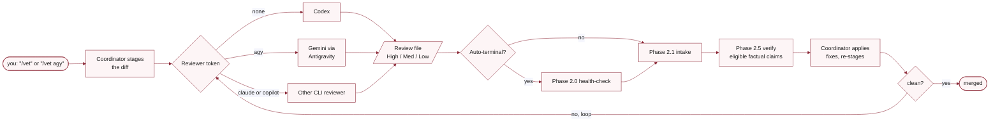

# implement-review

Structured cross-model review loop that sends staged changes to a reviewer agent and iterates until findings are resolved. Content-type-aware lenses apply established review criteria from the Google / Microsoft engineering playbooks (code), NeurIPS / ICLR / ICML / ACL guidelines (papers), and the NSF Merit Review / NIH Simplified Peer Review frameworks (proposals).

With `IMPLEMENT_REVIEW_DEFAULT_CHANNEL=auto`, use `/vet` for the default Codex reviewer or `/vet agy` for Gemini through Antigravity. Without that setting, write `/vet auto agy`. The Agy backend defaults to [`gemini-3.8-flash-high`](https://antigravity.google/docs/models/) at `high` effort; `gemini` and `antigravity` remain accepted aliases.

Reviewer choice does not reduce validation capability. Codex, Agy, Copilot, and headless Claude all run unattended with access to shell commands, tests, experiments, and necessary network verification. Agy and Claude use disposable staged snapshots when export succeeds, so verification may create generated artifacts without polluting the source checkout. The shared review contract still forbids commit, push, publication, external-system mutation, and destructive cleanup.

| Invocation | Reviewer | Review file |
|---|---|---|
| `/vet` | Codex | `Review-Codex.md` |
| `/vet agy` | Gemini 3.8 Flash High through Antigravity | `Review-Antigravity.md` |
| `/vet copilot` | GitHub Copilot CLI | `Review-GitHub-Copilot.md` |
| `/vet claude` | Headless Claude Code, subject to the self-review guard | `Review-Claude-Code.md` |

Phase 2.5 covers checkable High-priority findings, checkable Medium findings from Auto-terminal embedded-diff retry, and user-requested checks on Medium / Low findings.

See [Example reviews](references/example-reviews/example-code-phased.md) for complete worked examples across code, paper, and proposal lenses.


